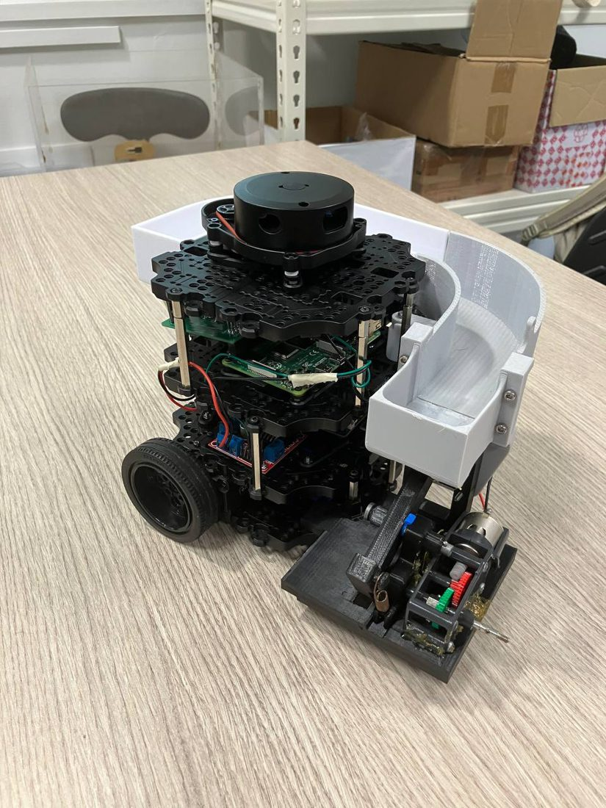
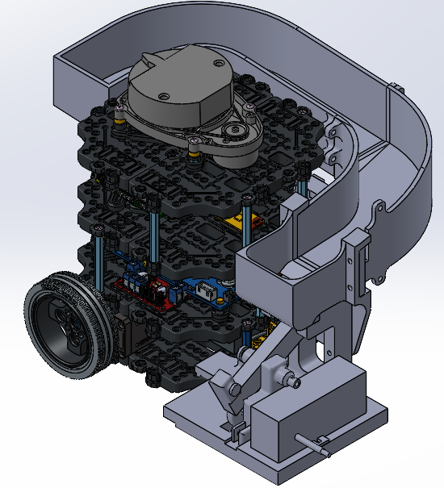
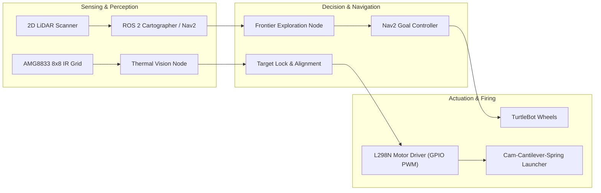
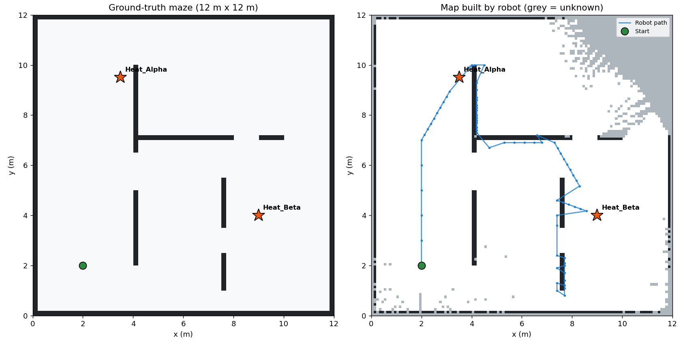

# Autonomous Search, Rescue & Target-Firing Mobile Robot

[](https://docs.ros.org/)
[](https://www.python.org/)
[](LICENSE)
[](Software/tests)

An end-to-end autonomous mobile robotics system built on TurtleBot, featuring autonomous SLAM frontier exploration, real-time infrared thermal target acquisition, and a custom 3D-printed cam-cantilever-spring ping-pong ball launcher.

<p align="center">
  
  
</p>

---

## System Architecture



## Key Features

- **Autonomous Frontier Exploration**: Nav2-integrated frontier exploration node driving complete environment mapping without teleoperation. Uses vectorized NumPy neighbor slicing for millisecond-level frontier discovery.
- **Thermal Heat-Source Tracking**: Real-time 8x8 thermal array processing identifying temperature differentials to detect victims or simulated heat targets.
- **Cam-Cantilever-Spring Launcher**: A geared DC motor rotates a custom surface cam that lifts a lever against an extension spring (14 mm stroke). When the lever drops off the cam step, the spring flicks it up to strike the ping-pong ball. Fed from a gravity hopper (8 balls + 1 in the launcher), and fired in 2 s / 4 s intervals.
- **Distributed ROS 2 Topology**: Workstation host handles heavy SLAM mapping and RViz visualization, while an onboard Raspberry Pi manages motor drivers, thermal I2C bus, and GPIO firing triggers.
- **Dual-Mode Simulation & Hardware Abstraction**: Seamlessly operates in real hardware mode (Raspberry Pi GPIO + Adafruit AMG8833) and standalone simulation mode (Gazebo / software testbed).

## Hardware Bill of Materials (BOM)

| Component | Model / Spec | Interface |
|---|---|---|
| Mobile Base | TurtleBot3 Burger / Custom Chassis | Dynamixel / UART |
| Onboard SBC | Raspberry Pi 4 Model B (4GB) | GPIO / I2C |
| Thermal Sensor | Panasonic / Adafruit AMG8833 | I2C (0x69) |
| Launcher Actuator | RE-260 DC motor + Ta72004 gearbox | L298N motor driver, GPIO PWM |
| 3D Printed Parts | Cam, lever, launcher body (PETG), hopper & sensor mount | Custom SolidWorks files in `/cad` |

## Subsystem Documentation

| Subsystem | README | Covers |
|---|---|---|
| Mechanical | [cad/README.md](cad/README.md) | Cam-cantilever-spring launcher, hopper, sensor mount, assembly, CAD file map |
| Electrical | [Electrical/README.md](Electrical/README.md) | PCB hat, wiring and pin map, power budget, BOM, Gerbers |
| Software | [Software/README.md](Software/README.md) | ROS 2 nodes, topics, thermal codes, launch files, tests |

## Repository Structure

```
├── cad/                     # 3D printable STL and STEP mechanical files
├── docs/                    # Figures (simulated map render)
├── Electrical/              # Schematics and sensor application datasheets
├── Software/
│   ├── cde2310/             # Main ROS 2 package (nodes, launch, params)
│   │   ├── launch/          # full_autonomy_launch.py, rpi.py, laptop.py
│   │   ├── config/          # nav2_params.yaml
│   │   └── cde2310/         # Thermal detection and motion control nodes
│   ├── workspace/           # Colcon workspace sources
│   ├── abandoned/           # Dropped prototypes (solenoid launcher)
│   └── tests/               # Automated maze simulation & unit test trials
└── LICENSE                  # MIT License
```

## Quick Start

### 1. Build the ROS 2 Workspace
```bash
cd Software/workspace
colcon build --symlink-install
source install/setup.bash
```

### 2. Launch Autonomous Search & Fire Routine
On the Raspberry Pi:
```bash
ros2 launch cde2310 rpi.py
```
On the workstation:
```bash
ros2 launch cde2310 laptop.py
```

### 3. Run Automated Maze Simulation Trials
To run the autonomous corridor exploration and thermal target neutralization testbed without physical hardware:
```bash
python Software/tests/test_maze_exploration.py
```
```

---

## Verification & Test Results

The autonomous navigation and target engagement logic was validated against a 12m × 12m maze environment with multi-corridor layouts and hidden heat targets:

```
======================================================================
  AUTOMATED SIMULATION TRIALS: CDE2310 AUTONOMOUS ROBOT
======================================================================
  STATUS: ALL TESTS PASSED (100% SUCCESS)
  - Vectorized Frontier Search: PASSED (0.002s avg)
  - Metric Coordinate Conversion: PASSED
  - Obstacle Blacklist Recovery: PASSED
  - Thermal Alignment & Launcher Firing: PASSED (2/2 targets neutralized)
  - Final Mapping Coverage: 88.0%
======================================================================
```



*Left: ground-truth maze with heat targets (stars) and start pose. Right: map uncovered by the simulated LiDAR (grey = unknown) and the poses where scans were taken. The sim moves the robot directly between frontiers without collision checking, so the line is not a drivable path. Regenerate with `python Software/tests/render_sim_map.py`.*
