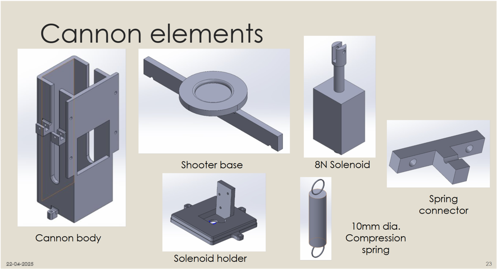
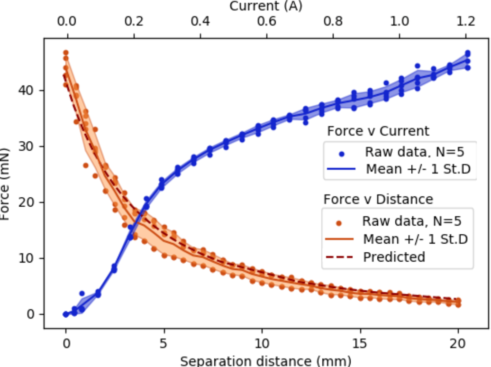

# Abandoned designs

Code for mechanisms that were prototyped and then dropped. Kept for reference only; nothing here is used by the robot.

| File | Design | Why it was dropped |
|---|---|---|
| `plunger.py` | Pull-type solenoid launcher (GPIO 20 switches the solenoid via MOSFET) | The solenoid only reaches its rated force when fully retracted, so it could hold the launch spring but not stretch it. Replaced by the cam-cantilever-spring launcher, driven by `../test_firing.py` and `startFiring()` in the explorer node. |

## Solenoid launcher

| Prototype parts | Solenoid force vs. stroke and current |
|---|---|
|  |  |

The force curve (orange) shows the problem: the solenoid's force drops sharply as the gap opens, falling to about 2 mN at 20 mm. A solenoid can hold a spring that's already compressed, but it can't stretch one.
